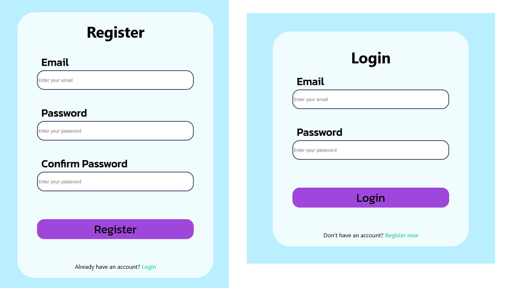
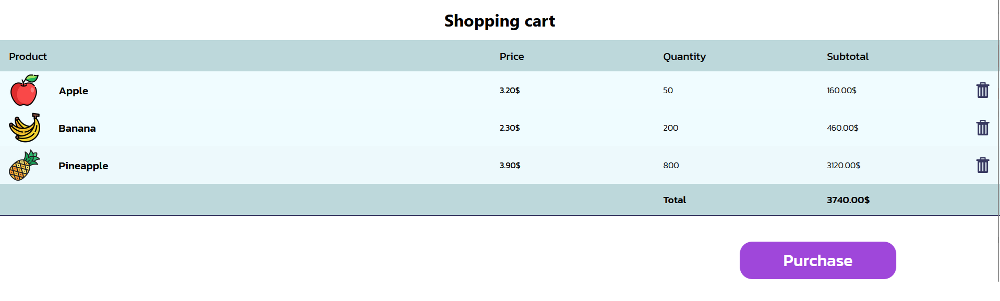
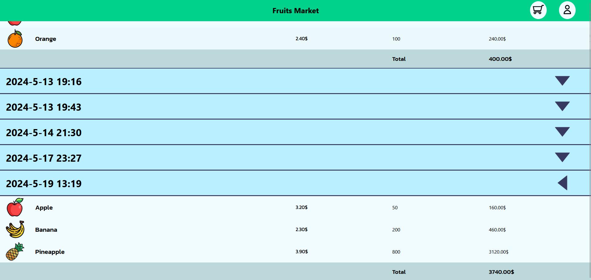

# Online Fruits Shop

## About
)

**Fruits Market** is an interactive and responsive shopping website that allows user to purchase the various fruits available. These fruits can be added to shopping cart and then after purchasing, the shopping cart products will be available as an order in `/orders` subpage. All orders are indexed by the date they were purchased. The fruits dispalyed on website are taken from database. Individual products can be added to that database using `Admin Panel`


## Technologies
- **Frontend**
    - HTML5
    - CSS
    - TypeScript (React)

- **Backend**
    - Java
    - Spring Boot

- **Database**
    - PostgreSQL


## How to set up

Clone repository `git clone https://github.com/WiktorGruszczynski/Online-Fruits-Shop`

### Frontend

Go to `client` directory

Use following command to install frontend dependencies

- #### `npm install`

Use following command to run react app
- #### `npm start`

### Backend

Go to `server/src/main/resources` directory.    
Create `application.properties` file.

Paste content below and fill blank values

```
spring.application.name = server
spring.datasource.url =
spring.datasource.username = 
spring.datasource.password = 

spring.jpa.hibernate.ddl-auto = update

spring.mail.host = smtp.gmail.com
spring.mail.port = 587
spring.mail.username =
spring.mail.password =

spring.mail.properties.mail.smtp.auth = true
spring.mail.properties.mail.smtp.starttls.enable = true
```

If you are not using PostgreSQL database, add line below and type the name of your dialect
`spring.jpa.properties.hibernate.dialect = TYPE YOUR DIALECT HERE`

### Database

Add products through admin panel, to open admin panel go to `/admin` subpage. Toggle switched to the right of save buttons are used for setting product visibility in store


## How to use

Click one of the navigation options, you will be automatically redirected to login page. 


Once you are on a login page click link on the bottom of login form in order to go to register page.
On register page enter your email and password and then confirm your account via confirmation link that will be sent to your email address



<br>

If you are signed in, you can go to home page and select products that you want to buy.
You can enter the quantity of choosen fruit or change that amount by clicking `minus` or `plus` buttons. 


<br>

After adding the fruit, it will be visible in `/cart` section that can be accesed via navigation icon. That section is a products cart, there are all products that have not been orderet yet.
If you added any product by mistake, you can simply remove by clicking a bin icon. If you want to purchase the content of your shopping cart, you only have to click `purchase` button. After that, all products should dissapear from your cart.



If you purchased list of your products, then the products should appear in `/orders` subpage. Here you can see all of your orders, they are sorted by the date of purchase.
For each order is displayed only the title with date when it was purchased, to see content of order you have to click the button in shape of triangle located on the right side of your screen.


